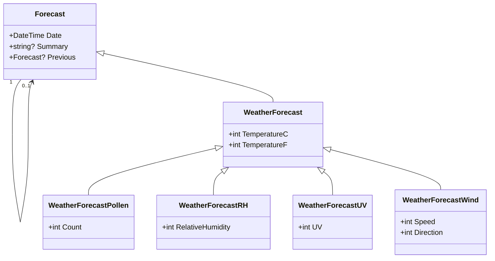

# Polymorphic JSON Marshalling
**TL;DR** `System.Text.Json` is broken, use `Newtonsoft.Json`




Newtonsoft.Json:
```json
{
  "$type": "Polymorphic.Models.WeatherForecastRH, Polymorphic.Models",
  "RelativeHumidity": 47,
  "TemperatureC": 13,
  "TemperatureF": 55,
  "Date": "2022-07-14T09:38:16.1820354Z",
  "Summary": "Fine, winds light to variable",
  "Previous": {
    "$type": "Polymorphic.Models.WeatherForecastRH, Polymorphic.Models",
    "RelativeHumidity": 45,
    "TemperatureC": -31,
    "TemperatureF": -23,
    "Date": "2022-07-13T09:38:16.1837775Z",
    "Summary": "Cloudy with a chance of meatballs",
    "Previous": null
  }
}
```

System.Text.Json:
```json
{
  "relativeHumidity": 47,
  "temperatureC": 13,
  "temperatureF": 55,
  "date": "2022-07-14T09:38:16.1820354Z",
  "summary": "Fine, winds light to variable",
  "previous": {
    "date": "2022-07-13T09:38:16.1837775Z",
    "summary": "Cloudy with a chance of meatballs",
    "previous": null
  }
}

```

`System.Text.Json` does not support polymorphic marshalling (serialisation + deserialisation): 
* [How to serialize properties of derived classes with System.Text.Json](https://docs.microsoft.com/en-us/dotnet/standard/serialization/system-text-json-polymorphism)
* [Support polymorphic deserialization](https://docs.microsoft.com/en-us/dotnet/standard/serialization/system-text-json-converters-how-to?pivots=dotnet-6-0#support-polymorphic-deserialization)

Whereas `Newtonsoft.Json` supports this via `TypeNameHandling.All`, though at the expense of reduced security:
* [Do not use TypeNameHandling values other than None](https://docs.microsoft.com/en-us/dotnet/fundamentals/code-analysis/quality-rules/ca2326)
* [TypeNameHandling Enumeration](https://www.newtonsoft.com/json/help/html/T_Newtonsoft_Json_TypeNameHandling.htm)

  _`TypeNameHandling` should be used with caution when your application deserializes JSON from an external source. Incoming types should be validated with a custom SerializationBinder when deserializing with a value other than `None.`_

* [[System.Text.Json] serialize/deserialize any object](https://github.com/dotnet/runtime/issues/30969#issuecomment-535779492)
* [How to configure Json.NET to create a vulnerable web API](https://www.alphabot.com/security/blog/2017/net/How-to-configure-Json.NET-to-create-a-vulnerable-web-API.html)

There are some incomplete workarounds:
* [Polymorphic Deserialization With System.Text.Json in .NET 5.0](https://badecho.com/index.php/2020/12/04/polymorphic-json-deserialization/)

